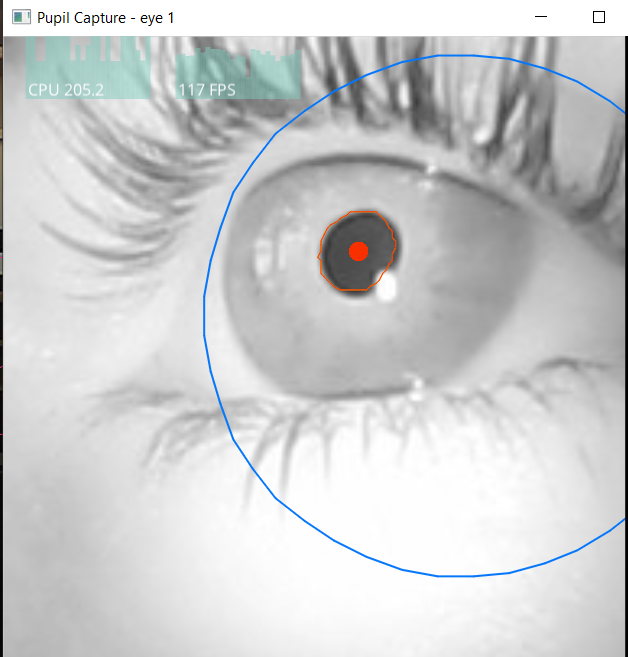
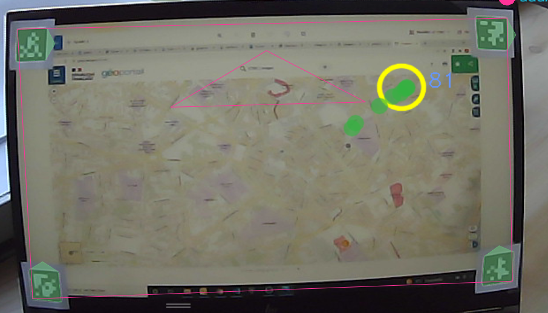
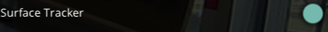
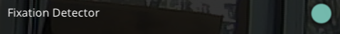

# eye_tracking

Python code for processing eye tracking data.

# Conseil d’utilisation de l’eye tracker :

## 1  Ouverture du logiciel 
Ouvrir l’application pupil capture et brancher l’eye-tracker.
## 2 Calibration :
### 2.1 Calibration sur l’oeil
Pour chacun des yeux, il est nécessaire de régler manuellement les caméras qui filment les yeux. Un cercle bleu doit apparaître sur le retour de la caméra comme le montre l'image suivante ou alors un cercle bleu clair pour que la caméra soit bien placé. 
 

### 2.2 Calibration de la lunette
La calibration de la lunette se fait à l’aide de l’interface de Pupil Capture.
Pour lancer la calibration il faut sélectionner la partie suivante :
 
Il faudra par la suite observer les cinq cibles qui apparaîtront sur l’écran en **gardant la tête immobile**. 
### 2.3 Test de la calibration
Il est important de tester la calibration après l’avoir faite. Il se peut qu’il y ait un certain décalage. Pour cela il faut regarder un point particulier et regarder la différence entre la réalité et le retour montré par le logiciel.
Faire photo
### 2.4 Point important sur la calibration
La calibration de l’appareil est très fine il est donc important de ne pas toucher le dispositif après calibration. S’il est touché il est important de recommencer la calibration.
## 3 Mesures
### 3.1 Définition d’une surface
Pour ajouter une surface il est nécessaire de rajouter des marqueurs pour la définir qui sont trouvables à l’adresse suivante : [marqueur](https://docs.pupil-labs.com/core/software/pupil-capture/?fbclid=IwAR1PUK2bf_XjfQKnOZtizlDN2OwXjR4twMVRD_qI-99Ei6HBlZOrZVcUBUw#surface-tracking). Ils doivent être positionnés sur la surface à définir comme le montre l’exemple suivant.
 

Avant de lancer l’acquisition il faut vérifier si les marqueurs sont bien détectés. Les marqueurs doivent être surlignés en vert comme l’exemple ci-dessus. De plus pour être sûr que les marqueurs vont être bien détectés durant l’acquisition, il est nécessaire d’avoir un **bon éclairage**.  
### 3.2 L’acquisition
Pour lancer l’acquisition il faut sélectionner le bouton suivant :  
 
Le même bouton est utiliser pour stopper l'acquisition.
 

## 4 post traitement
Les différentes étapes sont aussi réalisables avec Pupil Player avant le lancement de l’enregistrement
### 4.1 Emplacement des fichiers 
Les fichiers se situent dans un dossier recordings
### 4.2 Création d’une surface 
Il est possible qu’une surface soit déjà présente. Elle peut s’être ajoutée lors de l’enregistrement.
Pour ajouter une surface il faut dans un premier temps activé *Surface tracker* dans  *plugin manager*.
 
Une fois activé on peut accéder à l’onglet *surface tracker* afin de gérer les surfaces. Il est possible d’en ajouter et d’en supprimer.
  
### 4.3 Les points de fixation
Il faut aussi activer les points de fixation  dans *plugin manager*.
  

Une fois dans l’onglet *Fixation detector* il faut paramétrer les points de fixation. 
  

### 4.4 Export
 Il est possible d’exporter en sélectionnant le bouton suivant ou appuyer sur la touche *e*
Emplacement des fichiers par rapport à la surface se situent : *recordings\000\exports\000\surfaces*

# Les différents programmes :
Frame_identification.py : permet d’extraire les frames qui possèdent un point de fixation et de la découper selon une surface

Transpose_coordinate.py : permet d’obtenir les coordonnées en Lambert 93 des points de fixation par rapport à la carte affichée.
