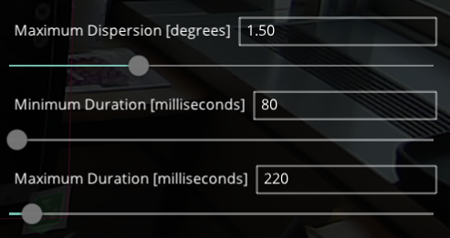

# eye_tracking

Python code for processing eye tracking data.

# How to use the Pupil Labs eye tracker :

## 1  Opening the software
Open the pupil capture application and connect the eye-tracker.
## 2 Calibration :
### 2.1 Calibration on the eye
For each of the eyes, it is necessary to manually adjust the cameras that film the eyes. A blue circle should appear on the camera return as shown in the following image or a light blue circle so that the camera is in the right position.
 

### 2.2 Calibration of the glasses
The calibration of the glasses is done using the Pupil Capture interface.
To start the calibration you have to select the following part:
 

You will then have to observe the five targets that appear on the screen by **keeping your head still**.
### 2.3 Testing the calibration
It is important to test the calibration after you have done it. It is possible that there is some discrepancy. To do this, look at a particular point and look at the difference between the reality and the feedback shown by the software.
Faire photo
### 2.4 Important point on calibration
The calibration of the device is very fine so it is important not to touch the device after calibration. If it is touched it is important to repeat the calibration.
## 3 Measures
### 3.1 Definition of a surface
To add a surface it is necessary to add markers to define it which can be found at the following address : [markers](https://docs.pupil-labs.com/core/software/pupil-capture/?fbclid=IwAR1PUK2bf_XjfQKnOZtizlDN2OwXjR4twMVRD_qI-99Ei6HBlZOrZVcUBUw#surface-tracking). They must be positioned on the surface to be defined as shown in the following example.
 

Before starting the acquisition, check that the markers are detected. The markers should be highlighted in green as in the example above. In addition, to be sure that the markers will be detected during the acquisition, it is necessary to have a **good lighting**.  
### 3.2 The acquisition
To start the acquisition, select the following button:
 

The same button is used to stop the acquisition. 

## 4 post processing
The different steps can also be done with Pupil Player before the recording is launched
### 4.1 File location 
The files are located in a recordings folder
### 4.2 Creating a surface 
It is possible that a surface is already present. It may have been added during the recording process.
To add a surface you must first activate *Surface tracker* in *plugin manager*.
 

Once activated, you can access the *surface tracker* tab to manage surfaces. It is possible to add and delete them.
  
### 4.3 Fixing points
You must also activate the fixation points in *plugin manager*.
  

Once in the *Fixation detector* tab, the fixation points must be set.
  

### 4.4 Export
 It is possible to export by selecting the following button or pressing the *e* key.

The location of the files in relation to the surface are : *recordings\000\exports\000\surfaces*

# The different programs :
Frame_identification.py : allows to extract the frames which have a point of fixation and to cut it according to a surface

As input: 
In a recordings folder :
- "world_timestamps.csv"
- "world.mp4"
- "fixations_on_surface_Surface 1.csv"
- "marker_detections.csv"

output:
- in /frame: the extracted frames that have a fixed point
- frame/surface_frame: the frames cut on the surface 

Transpose_coordinate.py : allows to obtain the coordinates in Lambert 93 of the fixation points in relation to the displayed map.

You have to set the parameters: box_coordinate and box_map.

As input : 
in a transpose file :
- "fixations_on_surface_Surface 1.csv"
- "world_timestamps.csv"
- "infoplayer.json"

output:
- in /transpose : coord_fixation_on_map_.csv